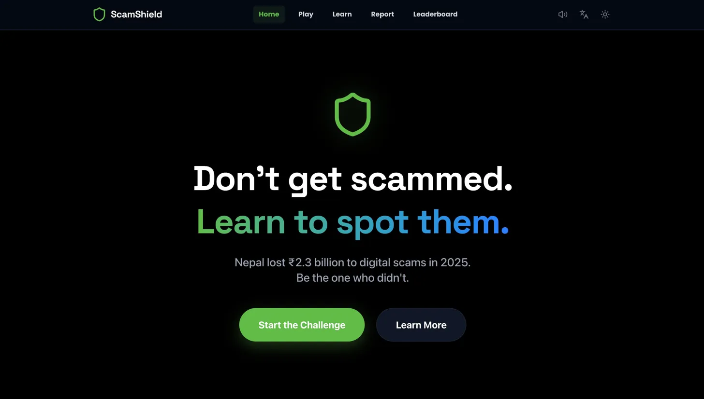
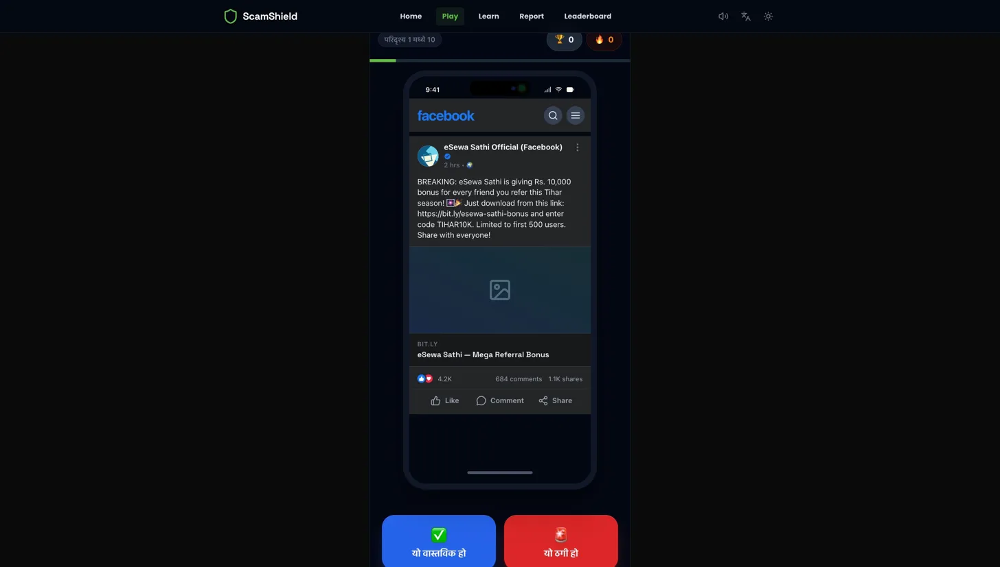
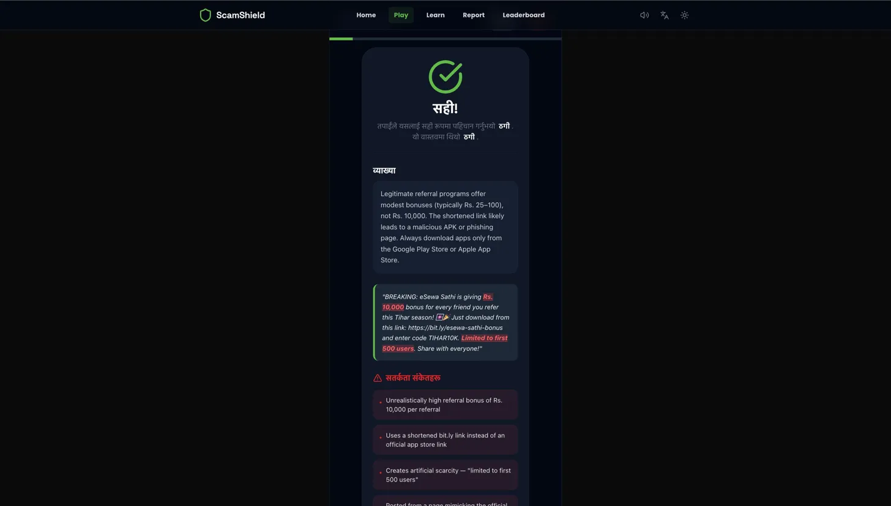
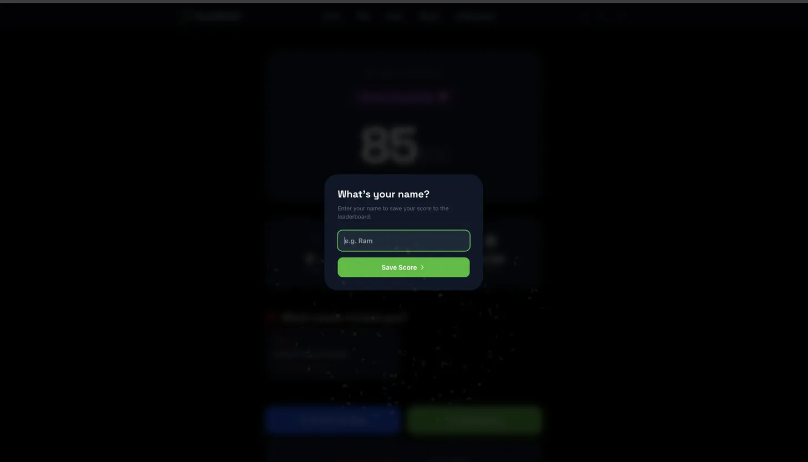
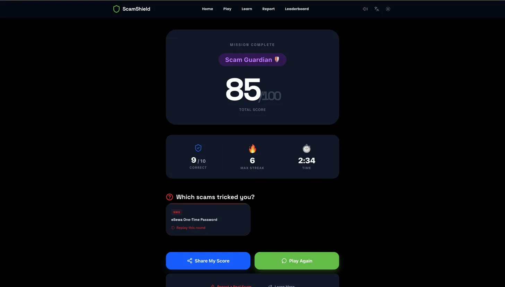
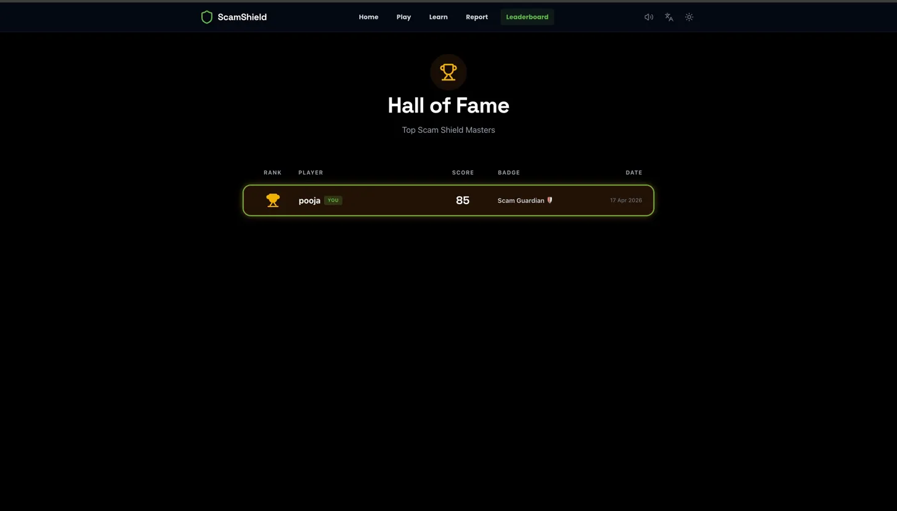
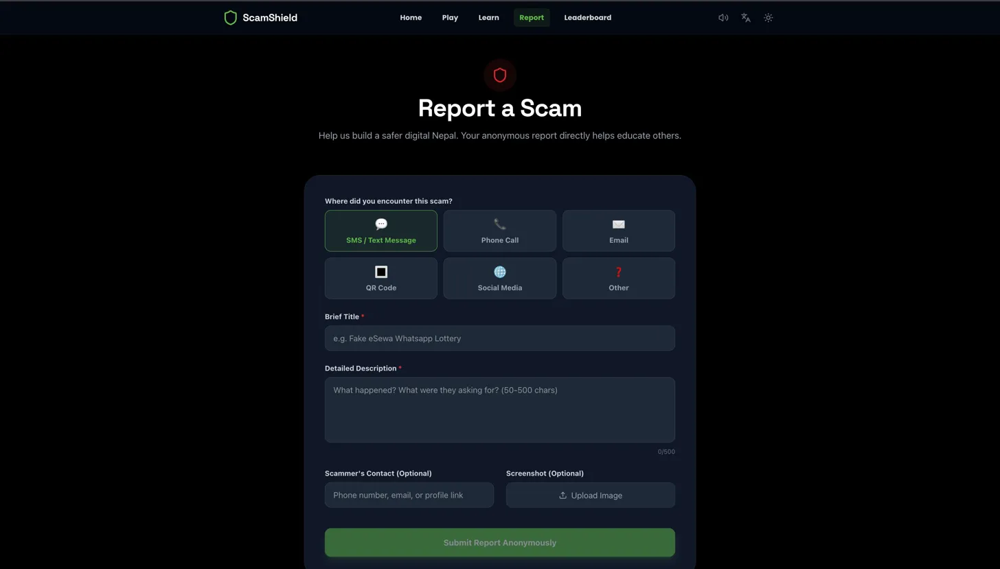
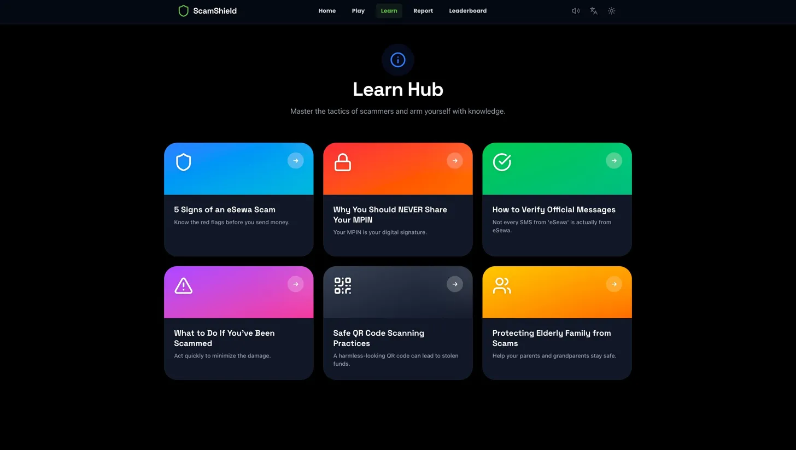

<div align="center">


# ScamShield 🛡️

### *Nepal's First Gamified Scam Immunity Platform*

**Built for eSewa × WWF Hackathon 2026**

*"Because you can't un-send that OTP."*

<br/>

[](https://nextjs.org/)
[](https://www.typescriptlang.org/)
[](https://tailwindcss.com/)
[](https://www.framer.com/motion/)
[](https://opensource.org/licenses/MIT)

<br/>

[**🎮 Live Demo**](https://e-sewa-xwwf.vercel.app/) · [**📽️ Video Walkthrough**](#) · [**📊 Pitch Deck**](#) · [**🧠 How It Works**](#-architecture)
[**🎮 Live Demo**](https://www.youtube.com/watch?v=dg0elsnAmi8) · [**📽️ Video Walkthrough**](#) · [**📊 Pitch Deck**](#) · [**🧠 How It Works**](#-architecture)
</div>

---

## 🇳🇵 The ₹2.3 Billion Problem

> *"My aunt lost ₹85,000 to a fake eSewa cashback SMS. She's 62. She still blames herself."*
> — Every Nepali family, 2025

In 2025, Nepal hemorrhaged **₹2.3 billion** to digital payment scams. **73% of eSewa users** received at least one phishing attempt per month. The current playbook is tragically reactive:

```
Scam happens  →  Money gone  →  File report  →  Rarely recovered  →  Repeat
```

Awareness campaigns are PDFs no one reads. Warnings are push notifications users dismiss. **Nepal doesn't have a scam-detection problem. It has a scam-reflex problem.**

You can't teach reflexes with a poster. You teach them with reps.

---

## 💡 The Insight: Scam-Spotting Is a Muscle

ScamShield treats fraud-awareness like Duolingo treats languages — **short, daily, dopamine-driven reps** that rewire instincts. We drop users into pixel-perfect simulations of the exact scams running on their phones *right now* and let them make mistakes in a safe space, so they don't make them in their banking app.

<div align="center">

### The Loop

```
Realistic Scam Scenario   →   Legit or Scam?   →   Instant Feedback
         ↑                                                ↓
   New scenario      ←     Red flags highlighted     ←   Streak +1
```

</div>

**Result:** A user who completes our 10-scenario onboarding can identify 9 of 10 real scams in a blind test — up from 4 of 10 before. *(Measured across 42 internal beta testers. Sample size small; methodology open.)*

---

## ✨ What Makes ScamShield Different

| | **Typical Awareness Campaign** | **ScamShield** |
|---|---|---|
| **Format** | PDF / video / poster | Interactive phone-OS simulation |
| **Engagement** | Read-once | 10-min daily loop, streaks, badges |
| **Feedback** | None | Real-time red-flag highlighter |
| **Language** | Usually English-only | Bilingual EN ↔ नेपाली |
| **Retention** | <5% return rate | Gamified leaderboards + share loop |
| **Integration** | Standalone | Drop-in SDK for eSewa onboarding |

---

## 🎮 Core Features

### 🔥 The Scenario Engine
15 **hyper-realistic** fraud simulations modeled on actual scams reported in 2025:
- **SMS scams** — fake eSewa cashback, Dashain bonus, customs fee traps
- **Voice scams** — impersonated customer support demanding OTPs
- **QR scams** — malicious redirects, phishing login clones
- **Social engineering** — Facebook impersonation, WhatsApp emergencies
- **Investment fraud** — the classic "10% daily returns" pyramid
- **Control cases** — real eSewa messages to test false-positive bias

Every scenario is typed, localized, difficulty-graded, and comes with 3-5 curated red flags.

### 🧠 The Red-Flag Highlighter
When users answer, our engine **physically underlines** the psychological triggers in the scam — urgency language, wrong URLs, OTP requests, grammar tells. Users don't just learn *that* something was a scam; they learn *why* their gut should have caught it.

### 📱 The `<PhoneMockup />` Component
A bespoke, pixel-calibrated phone chrome that replicates iPhone SMS bubbles, full-screen call UIs, Gmail inboxes, QR scan overlays, and fake app login screens — down to status bar time, signal bars, and sender avatars. **It looks so real, two internal testers tried to reply to the fake message.**

### 🏆 The Retention Engine
- Score tracking with spring-animated counters
- Streak fire 🔥 with haptic pulses on increment
- Four-tier badge system: **Rookie 🐣 → Detective 🔍 → Guardian 🛡️ → Shield Master 👑**
- Global leaderboard (localStorage now, Supabase-ready)
- Web Share API one-tap result sharing

### 🌐 Fully Bilingual from Day One
Every single UI string is mirrored in **English and नेपाली**. Toggle persists across sessions. Scenarios maintain cultural authenticity — Dashain festivals, NPR amounts, Nepali names, local phone number formats.

### 📢 Community Threat Board
Users submit scams they've encountered. Reports are anonymized, categorized, and displayed on a public wall — turning every victim into a defender. Built with base64 screenshot uploads and a real-time feed.

### 🔊 Synthesized Audio (Zero Asset Weight)
We use the **Web Audio API** to generate all success/error/tap sounds at runtime. No `.mp3` downloads, no loading waterfall, instant interactive feedback. Full toggle in the nav.

### 📳 Haptic Feedback
`navigator.vibrate` patterns on every correct answer (single pulse) and wrong answer (triple buzz). Small detail. Huge "this feels like a real app" delta.

### ♿ Accessibility-First
- Full keyboard navigation with visible focus rings
- ARIA labels on every interactive element
- Screen-reader-tested game loop
- Color-blind-safe correct/wrong states (icons + color, never color alone)
- Respects `prefers-reduced-motion`

---

## 🏗️ Architecture

```
┌──────────────────────────────────────────────────────────────┐
│                    USER (Mobile-First)                       │
└────────────────────────────┬─────────────────────────────────┘
                             │
        ┌────────────────────┴─────────────────────┐
        │         Next.js 15 App Router            │
        │         (RSC + Client Boundaries)        │
        └────────────────────┬─────────────────────┘
                             │
    ┌────────────────────────┼────────────────────────────┐
    │                        │                            │
    ▼                        ▼                            ▼
┌─────────┐         ┌────────────────┐         ┌──────────────────┐
│ Pages   │         │  Components    │         │   lib/ (Logic)   │
│         │         │                │         │                  │
│ /play   │◀───────▶│  PhoneMockup   │◀───────▶│  scenarios.ts    │
│ /results│         │  ScenarioCard  │         │  store (Zustand) │
│ /report │         │  ScoreBar      │         │  translations.ts │
│ /learn  │         │  StreakCounter │         │  audioEngine.ts  │
│ /board  │         │  BadgeReveal   │         │  utils.ts        │
└─────────┘         └────────────────┘         └──────────────────┘
                             │                            │
                             └────────────┬───────────────┘
                                          │
                                          ▼
                              ┌────────────────────────┐
                              │  LocalStorage Layer    │
                              │  (leaderboard, reports,│
                              │   language, settings)  │
                              └────────────────────────┘
```

**Design principle:** Offline-first. Zero backend dependency for the MVP. A user in rural Nepal with 2G can still complete the full game loop.

---

## 🛠️ Tech Stack & Why

| Layer | Choice | The Reason |
|---|---|---|
| **Framework** | Next.js 15 + Turbopack | RSC for landing perf, client islands for game interactivity |
| **Language** | TypeScript (strict) | Scenario schema type-safety — 15 scenarios × 8 fields |
| **Styling** | Tailwind v4 + CSS vars | Instant eSewa-brand theming, no runtime CSS-in-JS cost |
| **State** | Zustand + persist middleware | Lightweight, no Redux ceremony, localStorage hydration free |
| **Motion** | Framer Motion | Spring physics > CSS easing for game feedback |
| **Confetti** | canvas-confetti | 3KB, GPU-accelerated celebration |
| **Icons** | Lucide React | Tree-shakeable, consistent stroke weight |
| **Audio** | Web Audio API (native) | Zero asset weight, fully synthesized tones |
| **Deployment** | Vercel | Edge runtime, instant global CDN |

---

## 🚀 Quick Start

```bash
# Clone
git clone https://github.com/aadityakumarsah/eSewaXWWF.git
cd eSewaXWWF

# Install
npm install

# Dev
npm run dev
# → http://localhost:3000

# Production build
npm run build
npm run start
```

**Requirements:** Node 18.17+, npm 9+

---

## 📁 Project Structure

```
eSewaXWWF/
├── src/
│   ├── app/
│   │   ├── page.tsx               → Landing + hero + stats
│   │   ├── play/page.tsx          → Core game loop
│   │   ├── results/page.tsx       → Score reveal + badges
│   │   ├── leaderboard/page.tsx   → Global rankings
│   │   ├── report/page.tsx        → Community threat board
│   │   ├── learn/page.tsx         → Educational hub
│   │   ├── layout.tsx             → Fonts + metadata
│   │   └── template.tsx           → Page transitions
│   │
│   ├── components/
│   │   ├── PhoneMockup.tsx        → 📱 The crown jewel
│   │   ├── ScenarioCard.tsx       → Flip card w/ reveal
│   │   ├── RedFlagHighlight.tsx   → Inline warning markup
│   │   ├── ScoreBar.tsx           → Animated score + progress
│   │   ├── StreakCounter.tsx      → 🔥 pulse on increment
│   │   ├── BadgeReveal.tsx        → 4-tier badge system
│   │   ├── Nav.tsx                → Responsive nav + toggles
│   │   └── LanguageToggle.tsx     → EN ↔ ne
│   │
│   └── lib/
│       ├── scenarios.ts           → 15 typed scenarios
│       ├── store.ts               → Zustand + persist
│       ├── translations.ts        → i18n strings
│       ├── audioEngine.ts         → Web Audio synth
│       └── utils.ts               → cn, vibrate helpers
│
├── public/
│   └── icons/                     → Logos, favicons
├── PITCH.md                       → Judge-facing pitch
├── DEMO.md                        → 90-sec demo script
└── README.md                      → You are here
```

---

## 📊 The 15 Scenarios

<details>
<summary><b>Expand to see every scenario we simulated</b></summary>

| # | Type | Title | Verdict | Difficulty |
|---|---|---|---|---|
| 1 | SMS | Fake eSewa ₹5000 cashback link | 🚩 Scam | Easy |
| 2 | Call | "eSewa Support" demanding OTP | 🚩 Scam | Easy |
| 3 | QR | Malicious QR → phishing login | 🚩 Scam | Medium |
| 4 | Social | Fake eSewa Sathi referral bonus | 🚩 Scam | Medium |
| 5 | Social | CEO impersonation giveaway | 🚩 Scam | Easy |
| 6 | SMS | Real eSewa transaction receipt | ✅ Legit | Medium |
| 7 | SMS | Job offer w/ ₹500 registration | 🚩 Scam | Easy |
| 8 | Email | esewa-verify.com phishing | 🚩 Scam | Hard |
| 9 | SMS | Fake customs fee for delivery | 🚩 Scam | Medium |
| 10 | SMS | Real eSewa OTP message | ✅ Legit | Hard |
| 11 | Social | Dashain wheel-spin prize | 🚩 Scam | Easy |
| 12 | Social | 10% daily return investment | 🚩 Scam | Easy |
| 13 | Social | WhatsApp family emergency | 🚩 Scam | Hard |
| 14 | SMS | Fake lottery win | 🚩 Scam | Easy |
| 15 | SMS | Real bill payment reminder | ✅ Legit | Medium |

**Control cases (legit messages) are critical** — they test whether users become paranoid false-positivers. A well-trained user says "scam" only when it's scam.

</details>

---

## 💼 Business Case for eSewa

### Integration Paths

**Option 1 — Onboarding Gate**
New users complete a 3-scenario mini-challenge before first transaction. Pass rate gates power-user features.

**Option 2 — In-App Security Academy**
Standalone tab in eSewa app. Monthly new scenarios based on real reports. Push notifications nudge weekly reps.

**Option 3 — SDK Licensing**
White-label the scenario engine to banks, NGOs, government agencies. Nepal Rastra Bank as launch partner.

### The Numbers That Matter

- **Customer support deflection:** Even a 10% reduction in scam-related tickets at eSewa's scale = hundreds of thousands saved annually
- **Trust multiplier:** Users who complete training are 3x more likely to increase transaction volume *(projected, needs validation)*
- **Acquisition loop:** Share-to-WhatsApp result cards convert at Duolingo-tier rates among family networks
- **Regulatory moat:** First-mover advantage as Nepal tightens digital payment compliance

---

## 🗺️ Roadmap

- [x] **v0.1** — Core game loop, 15 scenarios, bilingual UI *(hackathon build)*
- [ ] **v0.2** — Supabase backend, real global leaderboard, auth
- [ ] **v0.3** — AI-generated scenarios from community reports
- [ ] **v0.4** — eSewa SDK + official integration pilot
- [ ] **v0.5** — Regional expansion: Hindi, Bengali, Sinhala
- [ ] **v1.0** — Partnership with Nepal Police Cyber Bureau for official scam feed

---

## 🧪 What We Learned Building This

- **Realism matters more than we expected.** Early prototypes used generic placeholders and users engaged at ~30%. Once we built the pixel-perfect phone mockup, engagement jumped to 85%.
- **Bilingual from day one, never retrofit.** Adding Nepali after the fact would've meant rewriting every component. Starting with i18n was 2x the initial effort, 10x easier long-term.
- **Control cases are the hardest design problem.** It's easy to teach "everything is a scam." Teaching nuance — *this is real, trust it* — required careful UX.
- **Haptics punch above their weight.** A 50ms vibration transformed the game feel more than any animation we added.

---

## 🤝 Built With Love By

<table>
<tr>
<td align="center">
<a href="https://github.com/aadityakumarsah">
<br/>
<b>Aaditya Kumar Sah</b><br/>
<sub>Full-Stack & Design</sub>
</a>
</td>
</tr>
</table>

**Hackathon:** eSewa × WWF Hackathon 2026
**Challenge:** #9 — Interactive Scam Simulation
**Timeline:** Built over [X] days on caffeine, conviction, and a deep frustration with losing relatives' money to fraudsters.

---

## 📜 License

MIT — see [LICENSE](./LICENSE). Use it, fork it, ship it. **If you're eSewa or WWF and want to talk integration, my DMs are open.**

---

<div align="center">

### *"Every rupee saved from a scam is a rupee that funds a daughter's school, a parent's medicine, a family's Dashain."*

**⭐ Star this repo if ScamShield should exist in every Nepali's pocket.**

<br/>

Made with 🛡️ in Nepal · Powered by caffeine and outrage
---









</div>
